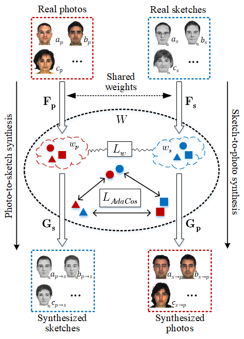

Exploiting an intermediate latent space between photo and sketch for face photo-sketch recognition
=====================
Seho Bae, Nizam Ud Din, Hyunkyu Park, and Juneho Yi

## Abstract
The photo-sketch matching problem is challenging because modality gap between photo and sketch is very large. This work features a novel approach to how to use an intermediate latent space between the two modalities that circumvents the problem of modality gap for face photo-sketch recognition. To set up a stable homogenous latent space between photo and sketch that is effective for matching, we utilize a bidirectional (photo → sketch and sketch → photo) collaborative synthesis network and equip the latent space with rich representation power. For providing rich representation power, we employ StyleGAN architectures such as StyleGAN and StyleGAN2. The proposed latent space equipped with rich representation power enables us to conduct accurate matching because we can effectively align the distributions of the two modalities in the latent space. In addition, to resolve the problem of insufficient paired photo/ sketch samples for training, we introduce a three-step mtraining scheme. Extensive evaluation on public composite face sketch database confirms superior performance of the proposed approach compared to existing state-of-the-art methods. The proposed methodology can be employed in matching other modality

</img></>

## Prerequisite
Tensorflow 1.8

Tensorflow code will be uploaded.

## Training
Our network has been trained through three-step training scheme.

(step 0)
The bidirectional photo/sketch synthesis network is trained using photo and sketch samples. We have used [CUFS](http://mmlab.ie.cuhk.edu.hk/archive/facesketch.html, "cufs") dataset.

(step 1)
The photo mapping network, $\mathbf F_{p}$, is pre-treained on the large photo database. We have used [CelebA](https://mmlab.ie.cuhk.edu.hk/projects/CelebA.html, "celeba") dataset.

(step 2)
Full network is trained on target photo/sketch samples. ([e-prip](http://biometrics.cse.msu.edu/Publications/Databases/PRIP-VSGC-Release_ReadMe.txt, "prip"))
